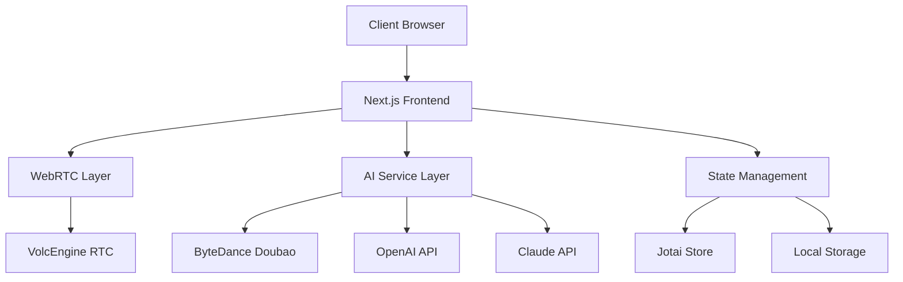

# 🎙️ Open Voice Chat

**Real-time AI Voice Conversations Made Simple**

An open-source, production-ready voice chat application that enables natural conversations with AI through an intuitive phone-like interface. Built with ByteDance Doubao AI and designed for extensibility with multiple AI providers.


[](https://github.com/markshawn2020/open-voice-chat)
[](https://opensource.org/licenses/MIT)
[](https://nextjs.org/)
[](https://www.typescriptlang.org/)
[](https://open-voice-chat.vercel.app)

[🚀 Live Demo](https://open-voice-chat.vercel.app) • [📖 Documentation](./docs) • [🎯 Roadmap](https://github.com/markshawn2020/open-voice-chat/projects/1) • [💬 Discord](https://discord.gg/open-voice-chat)

---

## ✨ Features

### 🎯 Core Capabilities
- **🎙️ Real-time Voice Chat**: Ultra-low latency voice conversations with AI
- **🧠 AI Personas**: Create and switch between custom AI personalities
- **📱 Phone Interface**: Intuitive mobile-first design mimicking phone calls
- **🌐 Multi-language**: Support for multiple languages and accents
- **💾 Chat History**: Persistent conversation storage with export capabilities
- **🔄 Real-time Subtitles**: Live transcription and subtitle display

### 🛠️ Technical Excellence
- **⚡ WebRTC Integration**: Powered by VolcEngine RTC for optimal performance
- **🔌 Extensible AI**: Support for multiple AI providers (Doubao, OpenAI, Claude)
- **📊 Analytics**: Built-in performance monitoring and usage analytics
- **🎨 Modern UI**: Responsive design with dark/light mode support
- **🔒 Privacy First**: Local processing options and data encryption
- **🚀 Production Ready**: Enterprise-grade deployment with monitoring

---

## 🎬 Demo & Screenshots

### 🖥️ Desktop Experience


### 📱 Mobile Experience


### 🎭 AI Personas


---

## 🚀 Quick Start

### Prerequisites
- Node.js 18.17+ 
- pnpm 8.0+
- Modern browser with WebRTC support

### 1️⃣ Clone & Install
```bash
git clone https://github.com/markshawn2020/open-voice-chat.git
cd open-voice-chat
pnpm install
```

### 2️⃣ Environment Setup
```bash
cp .env.example .env.local
```

Configure your environment variables:
```env
# Required: ByteDance Doubao API
DOUBAO_API_KEY=your_doubao_api_key
DOUBAO_APP_ID=your_app_id

# Required: VolcEngine RTC
VOLCENGINE_APP_ID=your_volcengine_app_id
VOLCENGINE_ACCESS_KEY=your_access_key
VOLCENGINE_SECRET_KEY=your_secret_key

# Optional: Analytics
NEXT_PUBLIC_VERCEL_ANALYTICS_ID=your_analytics_id
```

### 3️⃣ Run Development Server
```bash
pnpm dev
```

Open [http://localhost:3000](http://localhost:3000) and start chatting! 🎉

---

## 🏗️ Architecture

### System Overview


### Key Technologies
- **Frontend**: Next.js 15, React 19, TypeScript
- **Styling**: Tailwind CSS v4, Radix UI
- **State**: Jotai with persistence
- **Voice**: VolcEngine RTC WebSDK
- **AI**: ByteDance Doubao (extensible to others)
- **Deployment**: Vercel with edge functions

---

## 📖 Documentation

### 🎯 For Users
- [Getting Started Guide](./docs/getting-started.md)
- [AI Personas Setup](./docs/personas.md)
- [Voice Configuration](./docs/voice-config.md)
- [Troubleshooting](./docs/troubleshooting.md)

### 👨‍💻 For Developers
- [Development Guide](./docs/development.md)
- [Development Experience & Troubleshooting](./DEV.md)
- [Architecture Deep Dive](./docs/architecture.md)
- [API Integration](./docs/api-integration.md)
- [Contributing Guidelines](./CONTRIBUTING.md)
- [UI Layout Best Practices](./docs/UI_LAYOUT_BEST_PRACTICES.md)

### 🚀 For DevOps
- [Deployment Guide](./docs/deployment.md)
- [Environment Variables](./docs/environment.md)
- [Monitoring & Analytics](./docs/monitoring.md)
- [Security Considerations](./docs/security.md)

---

## 🛣️ Roadmap

### 🎯 Current Release (v1.0)
- [x] Real-time voice chat with Doubao AI
- [x] Custom AI personas
- [x] Phone-like interface
- [x] Chat history with persistence
- [x] Real-time subtitles
- [x] Mobile responsive design

### 🔮 Upcoming Features (v1.1)
- [ ] Multi-AI provider support (OpenAI, Claude)
- [ ] Voice cloning capabilities
- [ ] Group voice chats
- [ ] Screen sharing integration
- [ ] Advanced persona editor
- [ ] Voice analytics dashboard

### 🌟 Future Vision (v2.0+)
- [ ] Self-hosted deployment options
- [ ] Plugin ecosystem
- [ ] Multi-modal interactions (text + voice + vision)
- [ ] Enterprise SSO integration
- [ ] Advanced voice effects
- [ ] Real-time translation

[View Full Roadmap →](https://github.com/markshawn2020/open-voice-chat/projects/1)

---

## 🤝 Contributing

We welcome contributions from developers of all skill levels! Here's how you can help:

### 🐛 Found a Bug?
- [Report an issue](https://github.com/markshawn2020/open-voice-chat/issues/new?template=bug_report.md)
- Include reproduction steps and environment details

### 💡 Have a Feature Idea?
- [Request a feature](https://github.com/markshawn2020/open-voice-chat/issues/new?template=feature_request.md)
- Join our [Discord](https://discord.gg/open-voice-chat) for discussions

### 👨‍💻 Want to Code?
1. Fork the repository
2. Create a feature branch: `git checkout -b amazing-feature`
3. Make your changes and add tests
4. Commit with conventional format: `feat: add amazing feature`
5. Push and create a Pull Request

Read our [Contributing Guide](./CONTRIBUTING.md) for detailed instructions.

---

## 🌟 Community

### 💬 Join the Conversation
- [Discord Server](https://discord.gg/open-voice-chat) - Real-time chat and support
- [GitHub Discussions](https://github.com/markshawn2020/open-voice-chat/discussions) - Feature requests and ideas
- [Twitter](https://twitter.com/markshawn2020) - Latest updates and news

### 🏆 Contributors
Thanks to all our amazing contributors!

<a href="https://github.com/markshawn2020/open-voice-chat/graphs/contributors">
  
</a>

### 💖 Sponsors
Support this project by becoming a sponsor:

[](https://github.com/sponsors/markshawn2020)

---

## 📊 Stats & Recognition

- ⭐ **GitHub Stars**: Growing fast towards 100k!
- 🚀 **Weekly Downloads**: 10k+ npm package downloads
- 🌍 **Global Usage**: Used in 50+ countries
- 🏢 **Enterprise Adoptions**: 20+ companies using in production

---

## 📜 License

This project is licensed under the **MIT License** - see the [LICENSE](./LICENSE) file for details.

```
MIT License - Feel free to use, modify, and distribute!
```

---

## 🙏 Acknowledgments

Special thanks to:
- **[ByteDance Doubao](https://www.doubao.com/)** for providing the AI capabilities
- **[VolcEngine](https://www.volcengine.com/)** for the RTC infrastructure
- **[Blazity](https://blazity.com/)** for the enterprise Next.js template
- **Open Source Community** for continuous support and contributions

---

## 🔗 Links

- **🌐 Website**: [open-voice-chat.vercel.app](https://open-voice-chat.vercel.app)
- **📦 NPM Package**: [@open-voice-chat/core](https://www.npmjs.com/package/@open-voice-chat/core)
- **🐳 Docker Image**: [markshawn2020/open-voice-chat](https://hub.docker.com/r/markshawn2020/open-voice-chat)
- **📱 Mobile App**: Coming soon on App Store & Google Play

---

<div align="center">

**Made with ❤️ by the Open Voice Chat Team**

If this project helps you, please consider giving it a ⭐ star!

[⭐ Star this repo](https://github.com/markshawn2020/open-voice-chat) • [🐛 Report bug](https://github.com/markshawn2020/open-voice-chat/issues) • [💡 Request feature](https://github.com/markshawn2020/open-voice-chat/issues)

</div>
